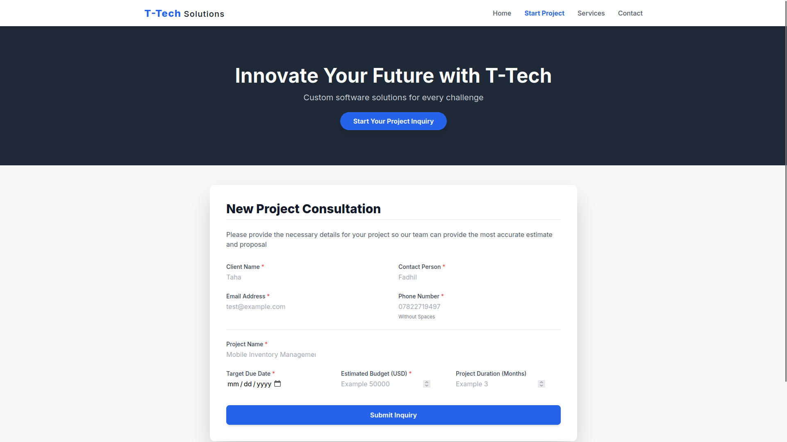

# T-Tech Project Inquiry Portal


A full-stack project inquiry form for a tech consultancy. This application features a responsive frontend, a Node.js backend, and saves all submissions to a local SQLite database.

## 📸 Preview



---

## ✨ Features

* **Responsive Frontend:** A clean, single-page inquiry form built with **HTML** and **Tailwind CSS**.
* **Node.js Backend:** An **Express.js** server to handle API requests.
* **Persistent Storage:** All form submissions are saved to a server-side **SQLite** database (`projects.db`).
* **Client-Side Validation:** JavaScript ensures all required fields are filled and correctly formatted before submission.

---

## 🚀 Getting Started

### 1. Prerequisites

- [Node.js](https://nodejs.org/) (v18 or later)

### 2. Installation & Setup

1.  Clone this repository:
    ```bash
    git clone [https://github.com/toto3mk/T-Tech.git](https://github.com/toto3mk/T-Tech.git)
    cd T-Tech
    ```
2.  Install the required npm packages:
    ```bash
    npm install
    ```

### 3. Run the Server

1.  Start the application:
    ```bash
    node server.js
    ```
2.  The server will start, and you'll see a confirmation in your terminal:
    ```
    Server is running! Open http://YOUR_SERVER_IP:3000 in your browser.
    Connected to the projects SQLite database.
    Table 'inquiries' is ready.
    ```
3.  Open your browser and navigate to `http://YOUR_SERVER_IP:3000` to use the form.

---

## 🔌 API Endpoint

The server provides one main endpoint:

| Method | Path | Description |
| :--- | :--- | :--- |
| `GET` | `/` | Serves the main `in.html` frontend. |
| `POST`| `/api/project-submission` | Receives form data (as JSON) and saves it to the SQLite database. |

---

## 📂 Project Structure
. ├── 📄 in.html (The HTML frontend) ├── 📄 server.js (The Node.js/Express backend) ├── 💾 projects.db (The SQLite database, auto-generated) ├── 🗃️ package.json ├── 🗃️ package-lock.json
